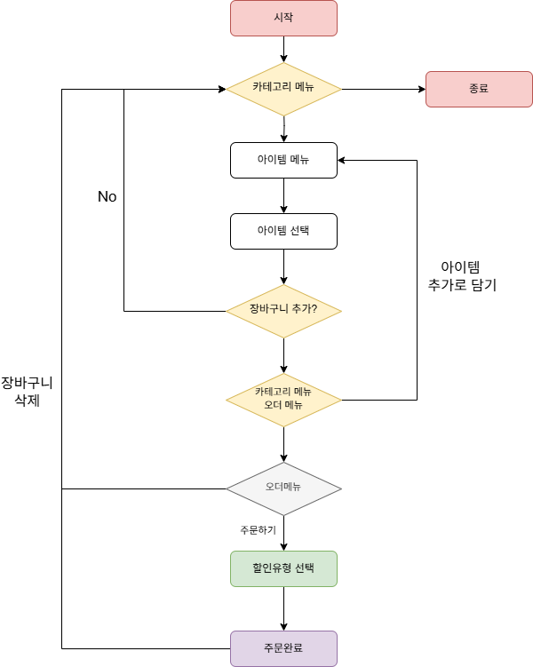
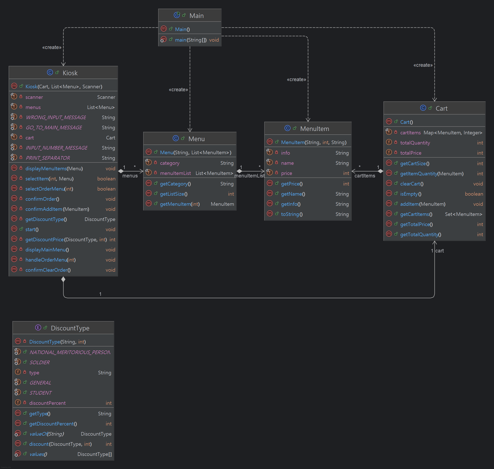

# 📌키오스크 프로젝트

## 📚목차

### [1. 📘프로젝트 소개](#프로젝트-소개)

### [2. 🛠️개발 환경](#개발-환경)

### [3. 📂디렉토리](#디렉토리)

### [4. 💡다이어그램 및 순서도](#다이어그램-및-순서도)

### [5. 🚀주요 기능](#주요-기능)

### [6. ☕블로그](#블로그)


&nbsp;

&nbsp;

&nbsp;

# 📘프로젝트 소개

### 1️⃣ 객체 지향 설계를 적용해 순서 제어를 클래스로 정의

### 2️⃣ 음식 메뉴와 주문 내역을 클래스 기반으로 관리

### 3️⃣ 메뉴를 담을 수 있는 장바구니 기능

### 4️⃣`Enum` 을 활용한 할인 유형에 따른 할인 적용 금액 산출

### 5️⃣ 구현기능을 레벨 별로 구성한 구조입니다.


# 🛠️개발 환경
[](https://skillicons.dev)


# 📂디렉토리
💡필수 구현 기능과 도전 기능 구현으로 패키지를 나누어 보았습니다. 각 해당 패키지는 레벨 별로 구성되어 있습니다.
```b
\---📁src
    +---📁advanced
    |   +---📁lv5
    |   |       Cart.java
    |   |       Kiosk.java
    |   |       Main.java
    |   |       Menu.java
    |   |       MenuItem.java
    |   |
    |   +---📁lv5ref
    |   |       Cart.java
    |   |       Kiosk.java
    |   |       Main.java
    |   |       Menu.java
    |   |       MenuItem.java
    |   |
    |   \---📁lv6
    |           Cart.java
    |           DiscountType.java
    |           Kiosk.java
    |           Main.java
    |           Menu.java
    |           MenuItem.java
    |
    \---📁basic
        +---📁lv1
        |       Main.java
        |
        +---📁lv2
        |       Main.java
        |       MenuItem.java
        |
        +---📁lv3
        |       Kiosk.java
        |       Main.java
        |       MenuItem.java
        |
        +---📁lv4
        |       Kiosk.java
        |       Main.java
        |       Menu.java
        |       MenuItem.java
        |
        \---📁ref
                Kiosk.java
                Main.java
                Menu.java
                MenuItem.java
```
# 💡다이어그램 및 순서도
## `📊순서도`

## `📋다이어그램`



# 🚀주요 기능

### 💡주요 기능은 마지막 레벨인 Lv6 기준으로 설명 드리겠습니다.

### 📌메뉴출력 
➡️ 카테고리 별로 메뉴 리스트를 출력하고 숫자 입력을 받습니다.
```java

[ MAIN MENU ]
1. BURGERS
2. BEVERAGES
3. DESSERTS
======================================================================
입력: 
```
### 📌상품 출력
➡️ 카테고리를 선택하면 카테고리에 해당하는 아이템 리스트를 출력하고 숫자 입력을 받습니다.
```java
======================================================================
입력: 1
======================================================================

[ BURGERS ]
1. ShackBurger     | W 6900 | 토마토, 양상추, 쉑소스가 토핑된 치즈버거
2. SmokeShack      | W 8900 | 베이컨, 체리 페퍼에 쉑소스가 토핑된 치즈버거
3. Cheeseburger    | W 6900 | 포테이토 번과 비프패티, 치즈가 토핑된 치즈버거
4. Hamburger       | W 5400 | 비프패티를 기반으로 야채가 들어간 기본버거

0. 뒤로가기
======================================================================
입력: 
```
### 📌장바구니 추가
➡️ 상품을 선택하면 선택된 상품을 출력하고 장바구니에 추가여부를 묻습니다.
```java
======================================================================
입력: 2
======================================================================

선택하신 상품: SmokeShack      | W 8900 | 베이컨, 체리 페퍼에 쉑소스가 토핑된 치즈버거

위 상품을 장바구니에 추가 하시겠습니까?
1. 확인           2. 취소
======================================================================
입력: 1
======================================================================
SmokeShack 이(가) 장바구니에 추가되었습니다 !
```
### 📌오더 메뉴
➡️ 장바구니에 상품이 담겨있으면 오더 메뉴가 출력됩니다. 오더 메뉴에서는 주문 진행과 장바구니를 삭제 할 수 있습니다.
```java
======================================================================
SmokeShack 이(가) 장바구니에 추가되었습니다 !

[ MAIN MENU ]
1. BURGERS
2. BEVERAGES
3. DESSERTS

[ ORDER MENU ]
4. Orders
5. Cancel
======================================================================
```
### 📌주문 확인
➡️ 주문 확인메뉴로 진입하면 장바구니에 담긴 상품들과 총 가격이 출력됩니다.

➡️ 같은 상품이 담기면 상품 옆에 수량이 올라갑니다 Map 자료구조를 사용하여 상품과 수량을 저장할 수 있게 구현하였습니다.

```java
입력: 4

[ ORDERS ]
SmokeShack      | W 8900 | 베이컨, 체리 페퍼에 쉑소스가 토핑된 치즈버거 * 1


[ TOTAL ]
  8900 W

주문하시겠습니까?
1. 주문           2. 취소
======================================================================
입력: 
```
### 📌할인 정보 확인
➡️ 주문을 진행하면 마지막 단계인 할인 정보 확인 출력으로 이동합니다. 각 할인 유형은 `Enum 클래스`로 구현하였습니다.

```java
======================================================================
입력: 1

할인 정보를 입력해주세요
1. 국가유공자   : 10 %
2. 군인      :  5 %
3. 학생      :  3 %
4. 일반      :  0 %
======================================================================
입력: 2

주문이 완료되었습니다. 결제 금액은 8455 원 입니다.
```


# ☕블로그

## 프로젝트 진행과정과 회고가 담긴 글입니다.

<a href="https://siwon0726.tistory.com/75"></a>

<a href="https://siwon0726.tistory.com/76"></a>

<a href="https://siwon0726.tistory.com/77"></a>

<a href="https://siwon0726.tistory.com/78"></a>

<a href="https://siwon0726.tistory.com/79"></a>

<a href="https://siwon0726.tistory.com/80"></a>
